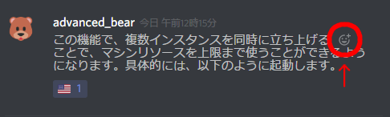
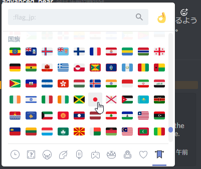

# Multilingual Master
## What is this?
This is the translation BOT program for Discord
Anyone can translate message with simple react action for specific post.

## How to use?
1. Click right-up corner face button on the post.

2. Choose the country-flag which you want to translate to. 

### Supported Languages
I choosed countries from G20.  
Some countries use same language, so this BOT support 14 languages.
- Japanese
- English
- Korean
- Chinese (Simplified )
- Indonesian
- Hindi
- Arabic
- French
- German
- Italian
- Spanish
- Portuguese
- Russian
- Turkish

## How to setup on my server?
### Requirement
- Google account which can use Google Apps Script
- Discord account which can make BOT account on developer page
- One computer which can run Node.js and access to the Internet.
- [Node.js](https://nodejs.org/)
### How to setup
1. [Look at here (Japanese page)](https://qiita.com/tanabee/items/c79c5c28ba0537112922) and make Google Apps Scripts which can get translate result with API.
1. [Look at here (Japanese page)](https://github.com/advancedbear/TweetDiscordStatus/blob/master/doc/DiscordBOT.md) and make BOT account on Discord Developers page.
1. Clone this repo
1. Enter the directory and run `npm install`
1. change the name of `config.json.sample` to `config.json`
1. Insert GAS URL and ClientID/token of Discord BOT to `config.json` and overwrite it.
1. run `node index.js --join` for joinning BOT account to the server. (You need admin role in the server.)
1. run `node index.js` and activate BOT. (You can check alive with enter `!MM` on Discord chat.）
### How to Daemon it?
#### On Windows
Use Winser.
Please google it how to use.
#### Linuxの場合
Use pm2.
Please google it how to use.

# Contact
Issues Page or [Twitter](https://twitter.com/advanced_bear)